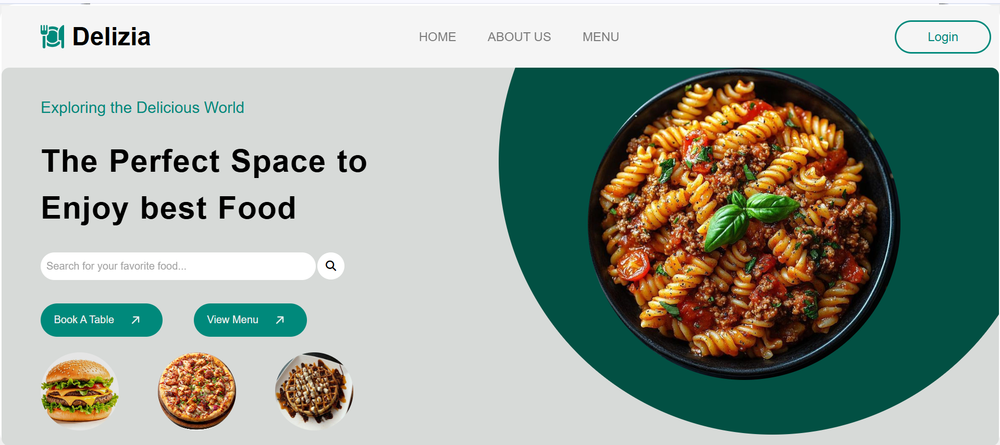
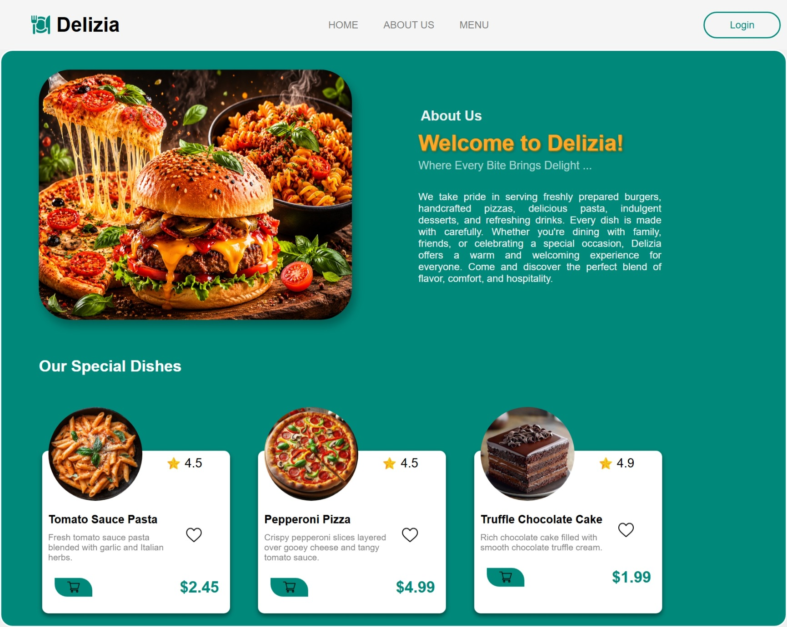
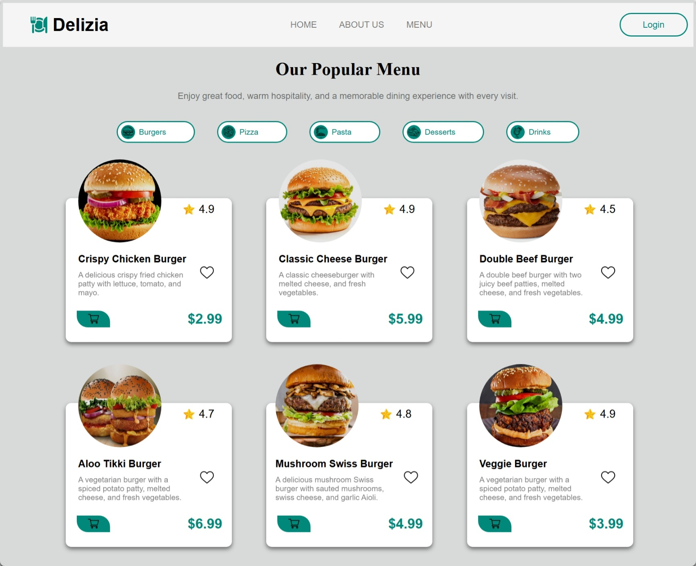
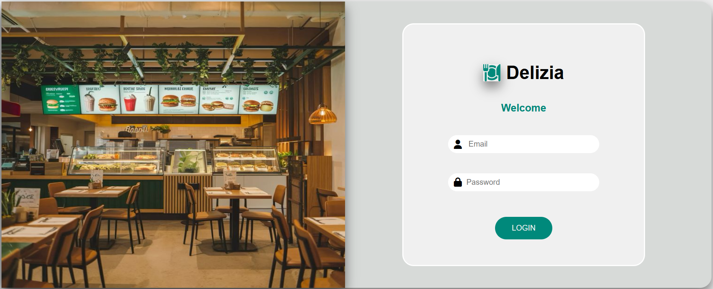
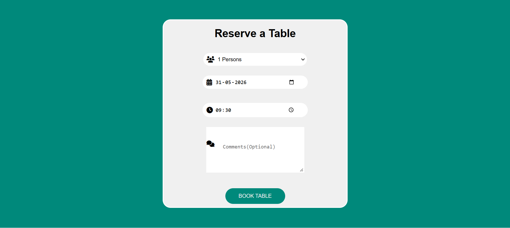
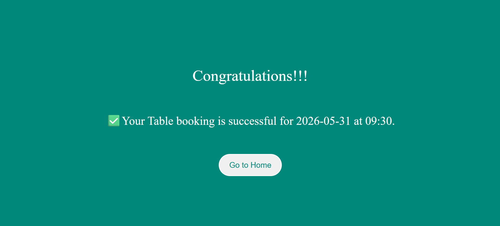

# 🍽️ Delizia - Restaurant Website

Delizia is a modern and responsive restaurant website designed to provide an engaging dining experience online. The website allows users to explore the menu, learn about the restaurant, and reserve tables through an intuitive and visually appealing interface.

## 🌐 Live Demo

👉 [View Website](https://delizia-restaurant-website.vercel.app/)

## 📸 Preview

### Home Page


### About Us Page


### Menu Page


### Login Page


### Table Reservation Page



---

## ✨ Features

- Modern and responsive design
- Interactive landing page
- Attractive food showcase section
- About Us section
- Online table reservation form
- User-friendly navigation
- Hover effects and animations

---

## 🛠️ Technologies Used

- HTML5
- CSS3
- JavaScript
- Font Awesome Icons
- Vercel (Deployment)

---

## 📂 Project Structure

```text
Delizia/
│
├── index.html
├── about.html
├── login.html
├── menu.html
├── navbar.html
├── tablebooking.html
├── styles.css
├── script.js
│
├── images/
│   ├── burger.jpg
│   ├── pizza.jpg
│   ├── pasta.jpg
│   └── ...
│
└── screenshots/
```

## 🚀 Getting Started

### Clone the Repository

```bash
git clone (https://github.com/Jhansi-kasa/restaurant_website)
```

### Open the Project

```bash
cd delizia
```

Open `index.html` in your browser or run the project using Live Server.

---

## 🎯 Key Highlights

- Designed a restaurant-themed user interface from scratch.
- Implemented responsive layouts using Flexbox.
- Built a table booking functionality using JavaScript.
- Created reusable UI components and interactive elements.
- Deployed the project using Vercel.

---

## 📈 Future Enhancements

- Food search functionality
- Online ordering system
- User authentication
- Customer reviews section
- Backend integration for reservations
- Payment gateway integration

---

## 👩‍💻 Author

**Jhansi Kasa**

GitHub: https://github.com/Jhansi-kasa

---

## ⭐ Support

If you like this project, consider giving it a **star ⭐** on GitHub.
